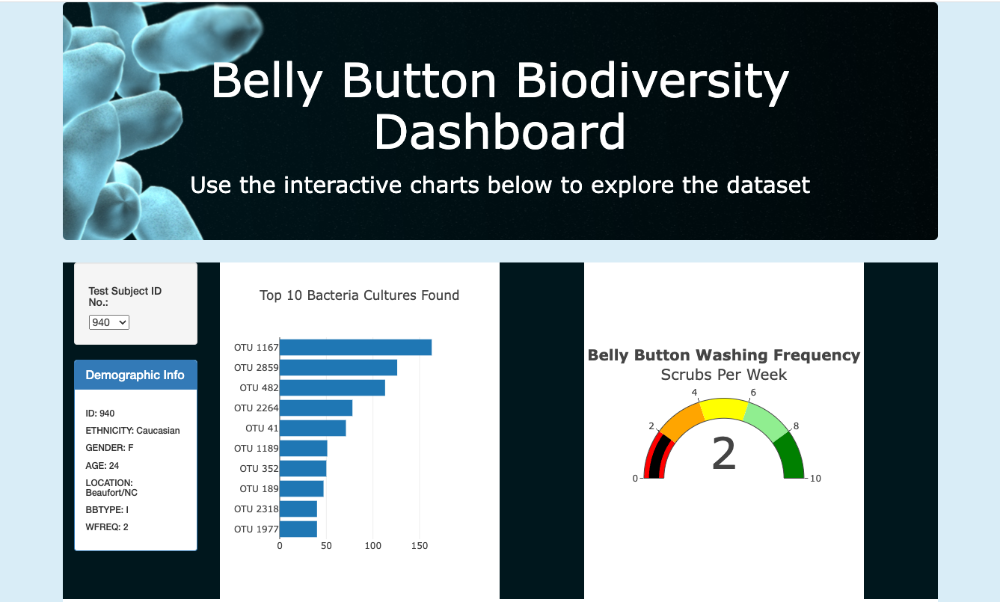
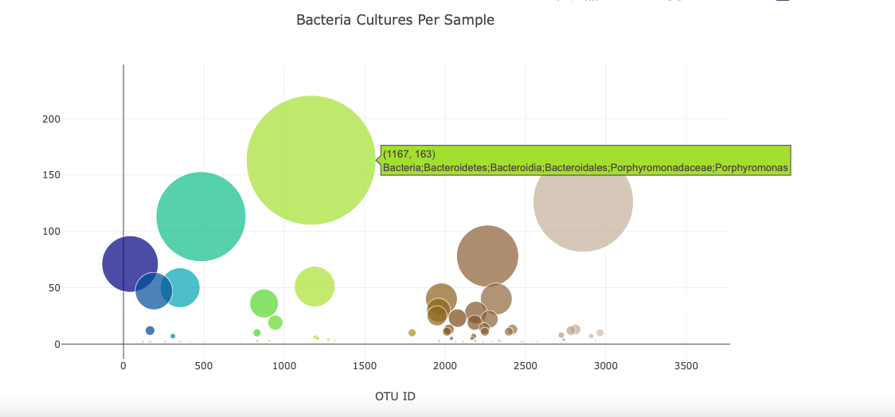

#  Belly Button Biodiversity

## Overview of the analysis:

Many bacterial species are not well studied and many remain unknown.  It is the hypothesis of a researcher at a prominent microbiologly laboratory that the best bactreria to make synthetic beef may be found in a persons belly button.  Using knowledge of JavaScript, Plotly, and D3.js,the purpose of this project is to visualize bacterial data from volunteers that have had there navels sampled.  We will create a horizontal bar chart to display the top 10 bacterial species (OTUs) when an individual’s ID is selected from a dropdown menu on the webpage.  We will also create a bubble chart to show the bacteria cultures per sample.  We also create a gauge chart that displays the weekly belly button washing frequency's as a measure from 0-10 when an individual ID is selected from the dropdown menu.

  
 
## Results:
 * Cultures Per Sample
      
     
## Additional Changes to Dashboard:   
 * Added an image to the jumbotron
 * Added a background color to the webpage.
 * Changed the Font and color of text in Jumbotron
